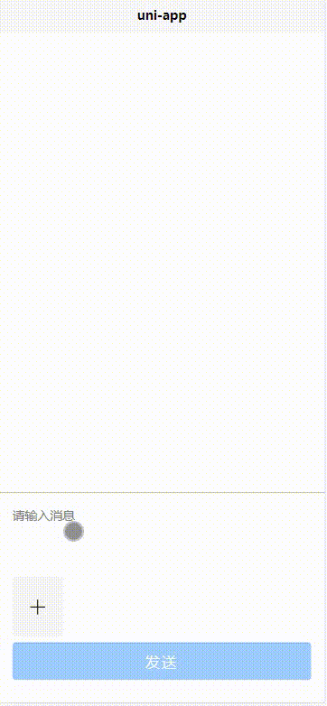

# Uniapp-Chatview
This is a uniapp component repository that can add a chat view to your uniapp.

## Installation
* you can download source zip file then add to your project directoy

## Usage
`<conversation/>`

## description

## License
[MIT](https://choosealicense.com/licenses/mit/)
